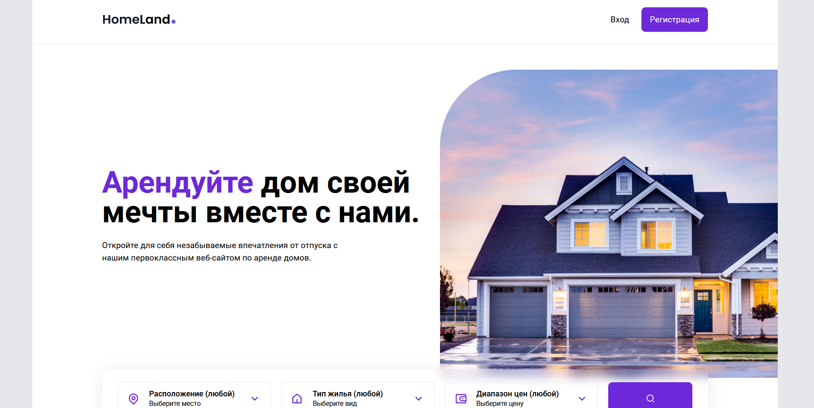

# HomeLand

## О проекте

HomeLand - это сайт-агрегатор, который помогает людям находить и арендовать жилище.

## Функциональность

-   Поиск жилья по параметрам
-   Отображение фотографий и детализированной информации о каждом объекте
-   Связь с нашим агентом через сайт

## Стэк технологий

-   React
-   TypeScript
-   Redux
-   TailwindCSS
-   React Router Dom

## Ссылка: https://homeland-flame.vercel.app/
